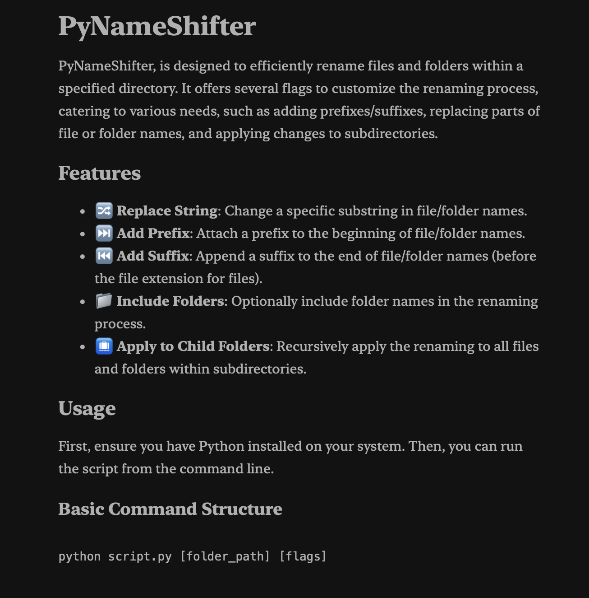
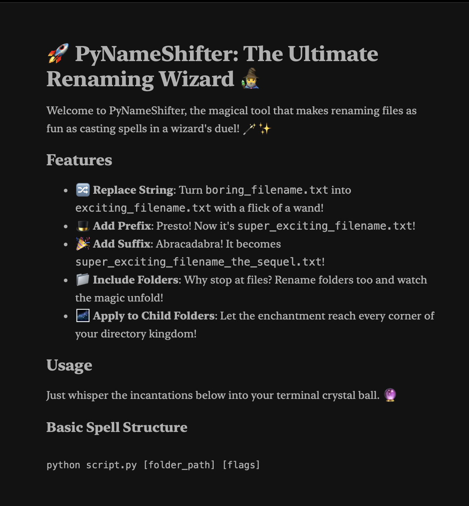

# PyNameShifter

PyNameShifter, is designed to efficiently rename files and folders within a specified directory. It offers several flags to customize the renaming process, catering to various needs, such as adding prefixes/suffixes, replacing parts of file or folder names, and applying changes to subdirectories.

___

| To a be continuted Formally | To a be continuted Wizardily.. |
| -------- | -------- |
|  |  | 

---

> [!WARNING]
> The rename action might not be reversible!
